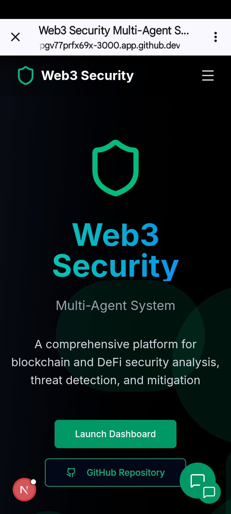
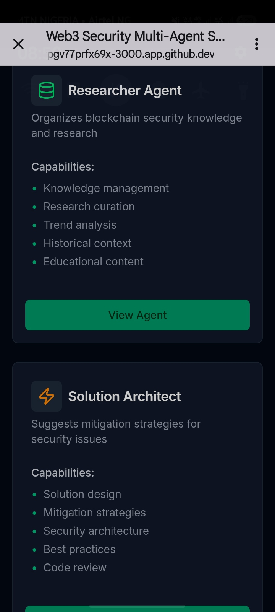
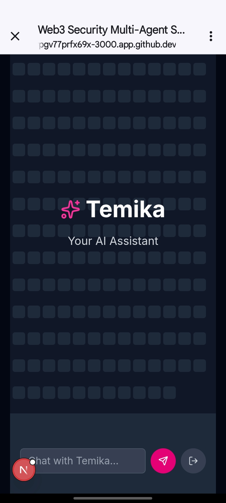

<h1>
🛡️ ⛓️ [ W E B 3 . S E C U R I T Y ] ⛓️ 🛡️
🛰️ MULTI-AGENT BLOCKCHAIN THREAT DETECTION
Architect: Oluwaseun Lawal

BLOCKCHAIN AUDIT | AGENTIC NEURAL OPS | DEFICONOMICS</h1>

📲 MOBILE SYSTEM INTERFACE PREVIEW

The following table showcases the high-fidelity UI of the Web3 Security Multi-Agent System, specifically designed for mobile-first tactical oversight.

 

<table align="center" style="border-collapse: collapse; text-align: center; background-color: #0b0e14; border: 2px solid #38B2AC; width: 100%;">
<!-- ROW 1: MOBILE APP SCREENSHOTS -->
<tr style="border-bottom: 2px solid #38B2AC;">
<td style="padding: 10px; width: 33%;">

</td>
<td style="padding: 10px; width: 33%;">

</td>
<td style="padding: 10px; width: 33%;">

</td>
</tr>
<!-- ROW 2: PADDED DESCRIPTION SPACE -->
<tr style="height: 100px; background-color: #1a1a1a;">
<td style="padding: 15px; vertical-align: top; color: #E2E8F0; border-right: 1px solid #38B2AC;">
<i>(Add Description for Dashboard Here)</i>
</td>
<td style="padding: 15px; vertical-align: top; color: #E2E8F0; border-right: 1px solid #38B2AC;">
<i>(Add Description for Agent Capability Here)</i>
</td>
<td style="padding: 15px; vertical-align: top; color: #E2E8F0;">
<i>(Add Description for Temika AI Chat Here)</i>
</td>
</tr>
</table>

 

🧬 CORE TACTICAL FEATURES

🛡️ BLOCKCHIAIN MONITORING: Continuous scanning for DeFi vulnerabilities and smart contract exploits.

🤖 MULTI-AGENT SWARM: Autonomous units (Researcher, Architect, Analyst) collaborating to mitigate risks.

✨ TEMIKA AI CONCIERGE: A high-speed Neural interface for natural language security auditing.

📊 DEEP MITIGATION STRATEGY: Automated architecting of defensive code patterns and security patches.

This README uses a combination of Markdown, HTML wrappers, and Shields.io badges to emulate high-contrast borders and background effects within the GitHub environment.

🛡️ WEB3-SENTINEL 🛡️

<table width="100%">
<tr>
<td bgcolor="#0d1117">
<h3>📜 Application Description</h3>

<b>Web3-Sentinel</b> is a specialized Next.js-based security orchestration platform. It utilizes a <b>Multi-Agent System (MAS)</b> to automate the detection, analysis, and mitigation of smart contract vulnerabilities and DeFi exploits in real-time. By coordinating 8 autonomous AI agents, it bridges the gap between threat intelligence and active defense.

</td>
</tr>
</table>
This README uses a combination of Markdown, HTML wrappers, and Shields.io badges to emulate high-contrast borders and background effects within the GitHub environment.

🛡️ WEB3-SENTINEL 🛡️

<table width="100%">
<tr>
<td bgcolor="#0d1117">
<h3>📜 Application Description</h3>

<b>Web3-Sentinel</b> is a specialized Next.js-based security orchestration platform. It utilizes a <b>Multi-Agent System (MAS)</b> to automate the detection, analysis, and mitigation of smart contract vulnerabilities and DeFi exploits in real-time. By coordinating 8 autonomous AI agents, it bridges the gap between threat intelligence and active defense.

</td>
</tr>
</table>

🛠️ Technical Specifications
<table width="100%">
<thead>
<tr>
<th bgcolor="#161b22" align="left">Category</th>
<th bgcolor="#161b22" align="left">Technology Stack</th>
</tr>
</thead>
<tbody>
<tr>
<td><b>Runtime & Framework</b></td>
<td>Node.js 22, Next.js 15.2.4 (App Router)</td>
</tr>
<tr>
<td><b>Language</b></td>
<td>TypeScript ^5 (Strict Mode)</td>
</tr>
<tr>
<td><b>UI & Animation</b></td>
<td>Tailwind CSS, Framer Motion, Radix UI, Lucide Icons</td>
</tr>
<tr>
<td><b>Visualizations</b></td>
<td>Recharts (Real-time analytics & Threat charts)</td>
</tr>
<tr>
<td><b>Infrastructure</b></td>
<td>PostgreSQL (Prisma), NextAuth.js, Google AI Studio</td>
</tr>
</tbody>
</table>

💻 Local Installation

[!IMPORTANT]
Ensure you have Node.js 22+ and pnpm installed before proceeding.

code
Bash
download
content_copy
expand_less
# 1️⃣ Clone the Command Center
git clone https://github.com/oluwaseun-lawal/web3-sentinel.git

# 2️⃣ Enter the Directory
cd web3-sentinel

# 3️⃣ Install Core Dependencies
pnpm install

# 4️⃣ Initialize Environment Variables
cp .env.example .env.local

# 5️⃣ Boot the Sentinel
pnpm dev
🗺️ Strategic Roadmap
<table width="100%">
<tr>
<th bgcolor="#1e293b">Phase</th>
<th bgcolor="#1e293b">Milestones</th>
<th bgcolor="#1e293b">Status</th>
</tr>
<tr>
<td><b>1. Infrastructure</b></td>
<td>Database Schema, Prisma Integration, NextAuth Configuration</td>
<td>🟡 In Progress</td>
</tr>
<tr>
<td><b>2. Intelligence</b></td>
<td>Gemini Pro API Integration, Live Web Scraping (Crawl4AI)</td>
<td>🔴 Pending</td>
</tr>
<tr>
<td><b>3. Analysis</b></td>
<td>Slither/Mythril Static Analysis Pipeline, Automated Reporting</td>
<td>🔴 Pending</td>
</tr>
<tr>
<td><b>4. Deployment</b></td>
<td>Real-time WebSockets, Multi-chain Monitoring, Vercel Edge Hosting</td>
<td>🔴 Pending</td>
</tr>
</table>

🛰️ Connect With Me

<table bgcolor="#0d1117">
<tr>
<td align="center" width="300">
 
<b>Oluwaseun Lawal</b> 
<i>Cyber Security Engineer</i>  

  
</td>
</tr>
</table>

🛠️ Technical Specifications
<table width="100%">
<thead>
<tr>
<th bgcolor="#161b22" align="left">Category</th>
<th bgcolor="#161b22" align="left">Technology Stack</th>
</tr>
</thead>
<tbody>
<tr>
<td><b>Runtime & Framework</b></td>
<td>Node.js 22, Next.js 15.2.4 (App Router)</td>
</tr>
<tr>
<td><b>Language</b></td>
<td>TypeScript ^5 (Strict Mode)</td>
</tr>
<tr>
<td><b>UI & Animation</b></td>
<td>Tailwind CSS, Framer Motion, Radix UI, Lucide Icons</td>
</tr>
<tr>
<td><b>Visualizations</b></td>
<td>Recharts (Real-time analytics & Threat charts)</td>
</tr>
<tr>
<td><b>Infrastructure</b></td>
<td>PostgreSQL (Prisma), NextAuth.js, Google AI Studio</td>
</tr>
</tbody>
</table>

💻 Local Installation

[!IMPORTANT]
Ensure you have Node.js 22+ and pnpm installed before proceeding.

code
Bash
download
content_copy
expand_less
# 1️⃣ Clone the Command Center
git clone https://github.com/oluwaseun-lawal/web3-sentinel.git

# 2️⃣ Enter the Directory
cd web3-sentinel

# 3️⃣ Install Core Dependencies
pnpm install

# 4️⃣ Initialize Environment Variables
cp .env.example .env.local

# 5️⃣ Boot the Sentinel
pnpm dev
🗺️ Strategic Roadmap
<table width="100%">
<tr>
<th bgcolor="#1e293b">Phase</th>
<th bgcolor="#1e293b">Milestones</th>
<th bgcolor="#1e293b">Status</th>
</tr>
<tr>
<td><b>1. Infrastructure</b></td>
<td>Database Schema, Prisma Integration, NextAuth Configuration</td>
<td>🟡 In Progress</td>
</tr>
<tr>
<td><b>2. Intelligence</b></td>
<td>Gemini Pro API Integration, Live Web Scraping (Crawl4AI)</td>
